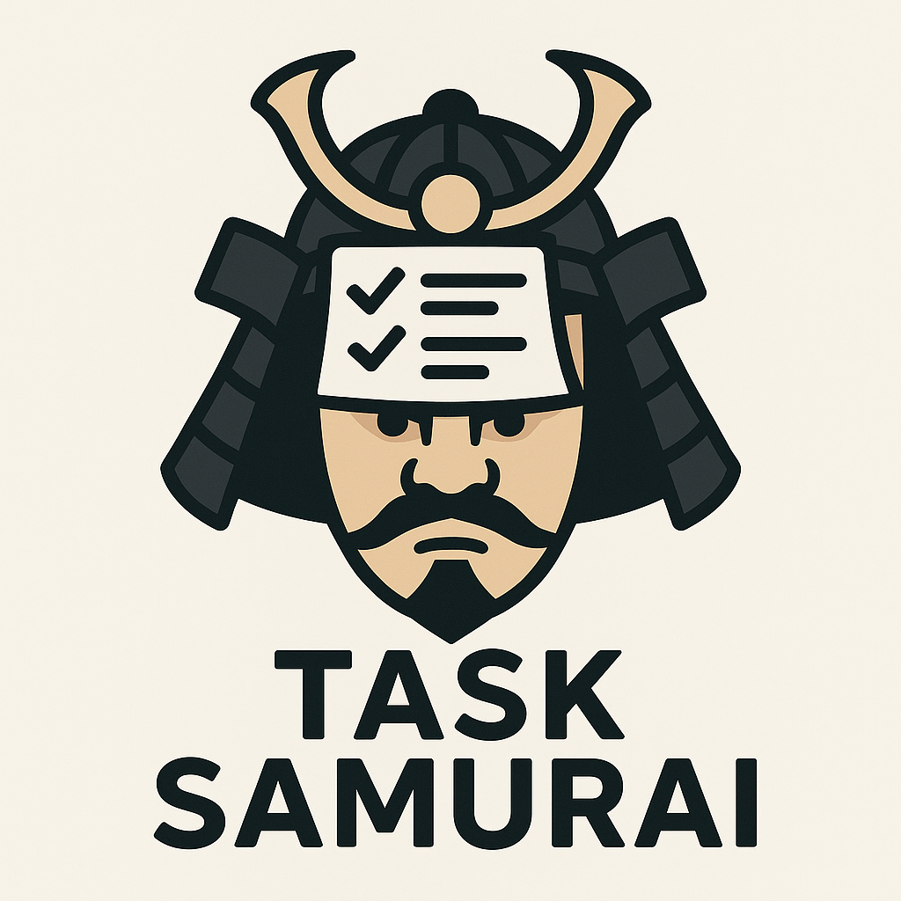

# Task Samurai

Task Samurai is a fast terminal interface for [Taskwarrior](https://taskwarrior.org/) written in Go using the [Bubble Tea](https://github.com/charmbracelet/bubbletea) framework. It shows your tasks in a table and lets you manage them without leaving your keyboard.

## Why does this exist?

- I wanted to tinker with agentic coding. This project was entirely implemented using OpenAI Codex.
- I wanted a faster UI for Taskwarrior than other options like vit which is Python based.
- I wanted something built with Bubble Tea but never had time to deep dive into it.

## How it works

Task Samurai invokes the `task` command to read and modify tasks. The tasks are displayed in a Bubble Tea table where each row represents a task. Hotkeys trigger Taskwarrior commands such as starting, completing or annotating tasks. The UI refreshes automatically after each action so the table is always up to date.

## Hotkeys

### Navigation

- `↑/k` and `↓/j`: move up and down
- `←/h` and `→/l`: move left and right
- `b/pgup`: page up
- `f/pgdn/space`: page down
- `u` or `ctrl+u`: half page up
- `d` or `ctrl+d`: half page down
- `g/home/0`: go to start
- `G/end`: go to end
- `enter`: expand/collapse the current cell

### Task actions

- `e` or `E`: edit task
- `s`: toggle start/stop
- `D`: mark task done
- `U`: undo last done
- `d`: set due date
- `r`: random due date
- `a`: annotate task
- `A`: replace annotations
- `p`: set priority

### Search

- `/` or `?`: start search
- `n` and `N`: next/previous search match

### Misc

- `H`: toggle help
- `q` or `esc`: close search/help or quit (press `q` when nothing is open)

