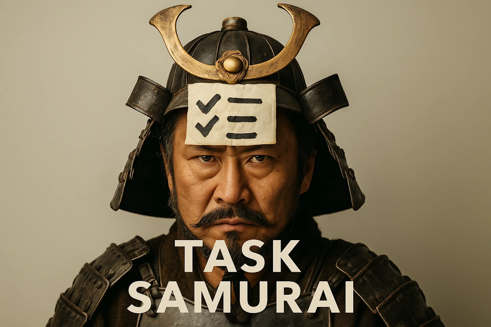
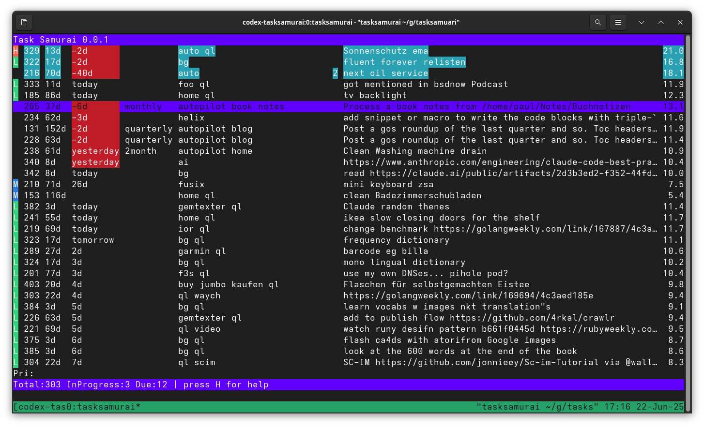

# Task Samurai

 

Task Samurai is a fast terminal interface for [Taskwarrior](https://taskwarrior.org/) written in Go using the [Bubble Tea](https://github.com/charmbracelet/bubbletea) framework. It shows your tasks in a table and lets you manage them without leaving your keyboard.

## Why does this exist?

- I wanted to tinker with agentic coding.
- I wanted a faster UI for Taskwarrior than other options like vit which is Python based.
- I wanted something built with Bubble Tea but never had time to deep dive into it.

## How it works

Task Samurai invokes the `task` command to read and modify tasks. The tasks are displayed in a Bubble Tea table where each row represents a task. Hotkeys trigger Taskwarrior commands such as starting, completing or annotating tasks. The UI refreshes automatically after each action so the table is always up to date.

## Hotkeys

### Navigation

- `↑/k` and `↓/j`: move up and down
- `←/h` and `→/l`: move left and right
- `b/pgup`: page up
- `pgdn`: page down
- `u` or `ctrl+u`: half page up
- `ctrl+d`: half page down
- `g/home/0`: go to start
- `G/end`: go to end
- `enter` or `i`: expand/collapse or edit the current cell depending on the column

### Task actions

- `e` or `E`: edit task
- `s`: toggle start/stop
- `d`: mark task done
- `o`: open URL from description
- `U`: undo last done
- `D`: set due date
- `+`: add task
- `r`: random due date
- `R`: edit recurrence
- `a`: annotate task
- `A`: replace annotations
- `p`: set priority
- `t`: edit tags

### Search

- `/` or `?`: start search
- `n` and `N`: next/previous search match

### Misc

- `f`: change filter
- `c`: random theme
- `C`: reset theme
- `x`: toggle disco mode
- `space`: refresh tasks
- `H`: toggle help
- `q` or `esc`: close search/help or quit (press `q` when nothing is open)

Example: press `+`, type `Buy milk` and hit Enter to add a new task called "Buy milk".

## Screenshot



## Installation

There are two ways to install the `tasksamurai` command:

```bash
go install codeberg.org/snonux/tasksamurai/cmd/tasksamurai@latest
```

Alternatively, clone this repository and run:

```bash
go-task install
```

The second method requires [go-task](https://taskfile.dev/) to be installed.

### Flags

- `--disco`: start Task Samurai in disco mode, changing the theme every time a task is modified.
