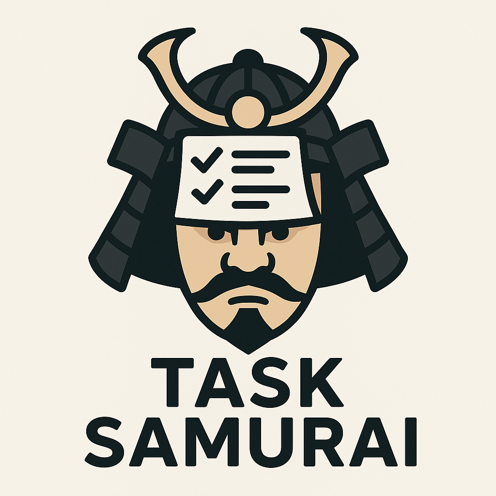
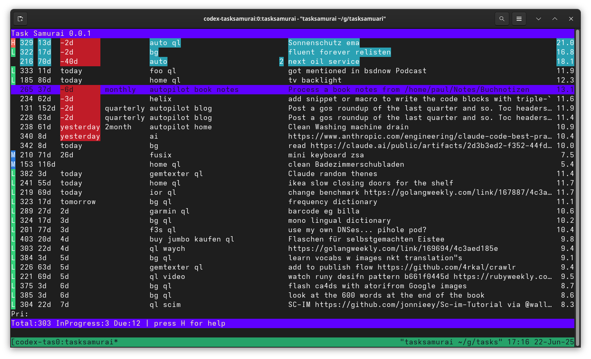

# Task Samurai



Task Samurai is a fast terminal interface for [Taskwarrior](https://taskwarrior.org/) written in Go using the [Bubble Tea](https://github.com/charmbracelet/bubbletea) framework. It shows your tasks in a table and lets you manage them without leaving your keyboard.

## Why does this exist?

- I wanted to tinker with agentic coding (actually, it has been mainly been generated by LLMs. 
- I wanted a faster UI for Taskwarrior than other options like vit which is Python based.
- I wanted something built with Bubble Tea but never had time to deep dive into it.

## How it works

Task Samurai invokes the `task` command to read and modify tasks. The tasks are displayed in a Bubble Tea table where each row represents a task. Hotkeys trigger Taskwarrior commands such as starting, completing or annotating tasks. The UI refreshes automatically after each action so the table is always up to date.

## Hotkeys

Press `H` to view all available hotkeys.

Example: press `+`, type `Buy milk` and hit Enter to add a new task called "Buy milk".

Press `R` to edit the selected task's recurrence. On a recurring task, press
`Ctrl+R` to edit the recurrence across the known recurring series.

Press `:` in either table or ultra mode to open a Taskwarrior command prompt.
The prompt supplies `task`; type arguments such as `add Buy milk`, `projects`,
or `+home list`. Press `;` to open the same prompt pre-filled with the selected
task UUID, ready for commands like `modify`, `annotate`, or `done`. Press `Tab`
for completion, `Enter` to run, and `Esc` to cancel. Press `Ctrl+O` while in
the prompt to pop the current command line out into `$EDITOR`; when you save and
quit, the edited text is loaded back into the prompt so you can review it and press
`Enter` to run. Commands that print output
open a scrollable output panel.

Task Samurai has several toggle keys. Press `v` to switch between the full
table and a compact view (Pri, Project, Description, Urg). Press `Z` to cycle
auto-refresh through off → 10s → 60s → 5m → 15m → off; while enabled the task
list reloads in the background as if you pressed `space` at the chosen
interval, and a persistent `auto-refresh: on (10s)` indicator appears in the
status line (works in compact and ultra mode too, and reloads pause while you
are typing). Press `B` to toggle the row blink animation after task
modifications, and press `x` to toggle disco mode, which picks a random theme
on every task change. Press `V` to cycle the completed-task display window
through off → 1 day → 4h → 1h → off: each setting additionally shows tasks
completed within that timeframe before now, dimmed grey with a struck-through
description and a `✓` in the ID column, sorted to the bottom of the list.
The current window shows up in the top status line as `completed: on (1d)`.
All of these are also listed on the in-app help screen
(`H`).

## Scrolling

Every screen scrolls. The task table pages with `pgup`/`pgdn` (or `b`), and
half pages with `Ctrl+U`/`Ctrl+D`. The help screen, the `:` command output
panel, and the task detail view scroll with `j`/`k` or arrow keys, page with
`pgup`/`pgdn` (or `b`/`space`), and half-page with `Ctrl+U`/`Ctrl+D`; `g`/`Home`
and `G`/`End` jump to the top or bottom. In the detail view, `↑`/`↓` move the
field highlight and the view scrolls to keep it visible; `/` searches the
detail view and `n`/`N` jump between matches. In table and ultra mode `space`
refreshes the task list instead of paging. All long content stays reachable —
nothing is cut off at the bottom of the screen.

## Screenshot



## Installation

There are two ways to install the `tasksamurai` command:

```bash
go install github.com/snonux/tasksamurai/cmd/tasksamurai@latest
```

Alternatively, clone this repository and run:

```bash
mage install
```

The second method requires [mage](https://magefile.org/) to be installed.

### Usage

```bash
# Start with default pending tasks
tasksamurai

# Start with a Taskwarrior filter
tasksamurai +tag status:pending
tasksamurai project:work due:today
tasksamurai pri:H
tasksamurai -- -excludetag
tasksamurai -- -excludetag +includetag

# Any valid Taskwarrior filter can be passed as arguments
```

### Flags

- `--version`: print the Task Samurai version and exit
- `--browser-cmd <command>`: command used to open URLs (default: firefox on Linux, open on macOS)
- `--youtube-browser-cmd <command>`: command used to open `youtube.com` / `youtu.be` links with the `o` key (default: `chromium`, so YouTube videos play in a browser better suited for them than the general `--browser-cmd` default). Set it to `""` to route YouTube links through `--browser-cmd` like any other URL.
- `--agent-hotkey <key>`: hotkey used to toggle the `+agent` / `-agent` filter (default: `3`)
- `--debug-log <path>`: path to debug log file for Taskwarrior commands
- `--debug-dir <directory>`: directory for runtime debug output (goroutine dumps, profiles)
- `--disco`: start Task Samurai in disco mode, changing the theme every time a task is modified

## Debugging

If Task Samurai hangs, freezes, or stops responding to hotkeys (e.g. `d`
does nothing), build with `-tags debugsignals` and send `SIGUSR1`/`SIGUSR2`
to the running process to capture goroutine stacks, a snapshot of the UI's
own state, and full profiling data. See [docs/debugging.md](docs/debugging.md)
for the full guide, including why hotkeys can silently stop working and how
to read each dump.
